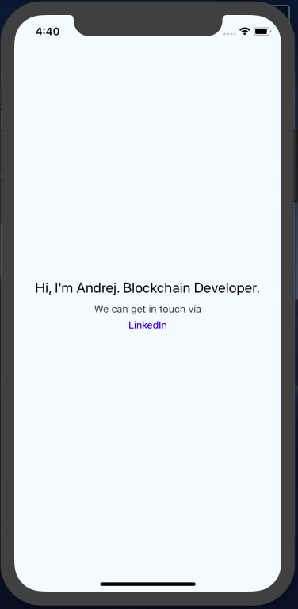
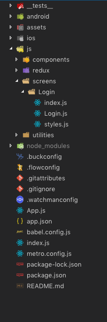

# How to setup your React Native app

Hi, I'm Andrej and I will show how to setup your own React Native mobile app. The power of React Native is that you can built both iOS and Android apps using one single code base.

So, let's begin.

### GETTING STARTED

Set up enviroment on your OS using [official documentation](https://facebook.github.io/react-native/docs/getting-started.html)

**Install command**

```
npm install -g react-native-cli
```

### CREATING A NEW APPLICATION

```
react-native init <AppName>
cd <AppName>
```

**Running on Android**

Be sure that emulator or real device is running

```
react-native run-android
```

**Running on iOS**

```
react-native run-ios
```

### Congratulations 🎉

You have successfully created your React Native App. You should see this screen.



If you click on LinkedIn text it will navigate you to my LinkedIn profile via browser on simulator and you will see something like this.


### RUNNING ON REAL DEVICE

**Android**

1. plug device via USB
2. on device: Settings --> About phone --> click Build number 7 times in a row
3. on device: Settings --> Developer options --> enable "USB Debbuging"
4. check device visibility `adb devices`
5. `react-native run-android`

**iOS**

1. plug device via USB
2. open xCode --> select device instead Generic iOS Device --> hit run button ▶️

---

### FILE ORGANIZATION

Folders **android** and **ios** are config folders for each platform. Folder **assets** contains pictures for ui, 3 each (pic1x, pic2x, pic3x). Folder **js** or **main**, or call it whatever you want, is where the main code base is located. It has 4 folders: **components**, **screens**, **redux**, **utilities**.
**Components** is where all .jsx components are located (Button, TextInput, SearchBar, etc.).
**Screens** is where all screens are located. I am using functional components and I love to divide them into three parts (index.js, styles.js, ComponentName.js) but later about that.
**Redux** contains three more folders: actions, reducers, constants and store. Here goes whole redux logic.
**Utilities** is folder where I love to store helper .js files which helps me in development, makes my code cleaner and I can reuse them in multiple projects which saves me time.

Your file organization should look like this



You notice that I use Redux in my development. Here are commands for installation. Third command is optional, you can choose either Redux-Thunk or Redux-Saga. It is really developer's choice.

```
$ npm install --save redux
$ npm install react-redux

$ npm install redux-thunk
    // or
$ npm install redux-saga
```

Also, I am using Wix Navigation but you can use React Native Navigation or some third library as well. Again, it's developer's choice. If you want to use Wix 2, here's the installation command.

```
npm install --save react-native-navigation
```

---

### Functional (Stateless) Components

Here at Blockchain systems, we use Functional Components, Hooks and Redux in development.

The structure of each component is divided into three main parts (index.js,styles.js, <ComponentName>.js). Let's assume, for example, that we have a Component which counts number of likes at some social networking platform, like Instagram. Structure of that component will look like this:

`LikesCounter`

- index.js
- styles.js
- LikesCounter.js

index.js contains all of components logic (functions, hooks, algorithms, etc.).

styles.js contains only StyleSheet for given screen

LikesCounter is pure .jsx code (functions and styles are imported).

Code is much cleaner now 😎.

**/screens/LikesCounter/index.js**

```
import LikesCounter from './LikesCounter';
import React, { useState, useEffect } from 'react';

const index = () => {
  const [numberOfLikes, setNumberOfLikes] = useState(0);

  useEffect(() => {
    // load picture info from database ...
  }, [numberOfLikes]);

  _handleLike = () => {
    setNumberOfLikes(numberOfLikes + 1);
  }

  return(
    <LikesCounter data={numberOfLikes} actions={_handleLike} />
  );
};

export default index;
```

**/screens/LikesCounter/styles.js**

```
import { StyleSheet } from 'react-native';

export default StyleSheet.create({
  container: {
    flex: 1,
    flexDirection: 'column',
    alignItems: 'center',
    jusifyContent: 'center'
  }
})
```

**/screens/LikesCounter/LikesCounter.js**

```
import React from 'react';
import { View, Text } from 'react-native';

// UI elements
import styles from './styles';
import Button from '../../../ui/Button';

export default LikesCounter = props => {
  const numberOfLikes = props.data;
  const _handleLike = props.actions;

  return(
    <View style={styles.container}>
      <Text> Likes: {numberOfLikes} </Text>
      <Button text={'Like'} onPress={() => _handleLike()} />
    </View>
  );
};
```

---

### Hooks

You can start learning hooks [here](https://reactjs.org/docs/hooks-overview.html).

##### useState

We call it inside a functional component to add some local state to it. `useState` returns a pair: the _current state_ and a function that lets you update it. The only argument to `useState` is the initial state.

Examples:

```
const [username, setUsername] = useState('');
const [likes, setLikes] = useState(0);
const [isActive, setIsActive] = useState(false);
```

##### useEffect

You’ve likely performed data fetching, subscriptions, or manually changing the DOM from React components before. We call these operations “side effects” because they can affect other components and can’t be done during rendering.

`useEffect` adds the ability to perform side effects from a functional component. It serves the same purpose as `componentDidMount`, `componentDidUpdate` and `componentWillMount` in React classes, but unified into a single API.

General syntax:

```
 useEffect(() => {
   effect
   return () => {
     cleanup
   };
 }, [input])
```

**effect** represents code inside `componentDidMount`. These are some functions that need to be executed before screen appears like fetching some data from database for example.

**return cleanup** represents code inside `componentWillMount`. These are some functions that need to be executed before screen disapears, like unsubsrcibe from some events or memory cleanup.

**[ input ]** represents code inside `componentDidUpdate`. Every time when **input** change screen will re-render (and execute **effect**). If you type [] (without input), screen will render just once.

Examples:

```
useEffect(() => {
  getUserData(email);
}, [])

useEffect(() => {
  ChatAPI.subscribeToFriendStatus(props.friend.id);
  return () => {
    ChatAPI.unsubscribeFromFriendStatus(props.friend.id);
  };
}, [props.friend.id]) // Only re-subscribe if props.friend.id changes
```

---

### Redux

You can start learning redux [here](https://redux.js.org/introduction/getting-started)

Redux is state managment tool in React and React Native apps. Redux allows you to manage your entire application state in one object, called the **Store**. Updates to the Store will trigger re-renders of components that are connected to the part of the store that was updated. When we want to update something, we call an **Action**. We also create functions to handle these actions and return the updated Store. These functions are called **Reducers**.


Connect everything in Functional Component

```
import React from 'react';
import { connect } from 'react-redux';
import { logoutUser } from '../../redux/actions/authActions';
import Account from './Account';

const index = ({ history, logoutUser, auth }) => {
	return <Account routes={history} actions={logoutUser} states={auth} />;
};

const mapStateToProps = state => ({
  // prop name <= store slice
	auth: state.auth
});

const mapDispatchToProps = {
  // prop name => dispatch action
	logoutUser
};

export default connect(
	mapStateToProps,
	mapDispatchToProps
)(index);
```

---

### Debugging & Shortcuts

Reload --> **cmd + R** (MacOS - ios/android), **rr** (Linux/Windows - android)

Debug remotely --> **cmd + D** (MacOS - ios), **cmd + M** (MacOS - android), **ctrl + M** (Linux/Windows - android)

When you hit Debug remotely web based debugger toggles up on **http://localhost:8081/debugger-ui**

However, my recommendation is to download [this debugger](https://github.com/jhen0409/react-native-debugger)


